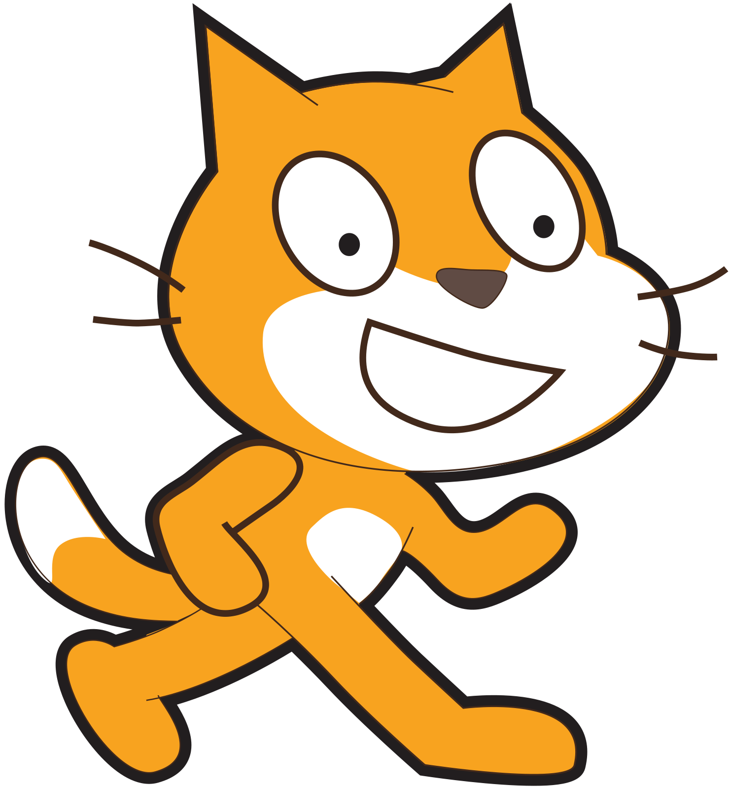
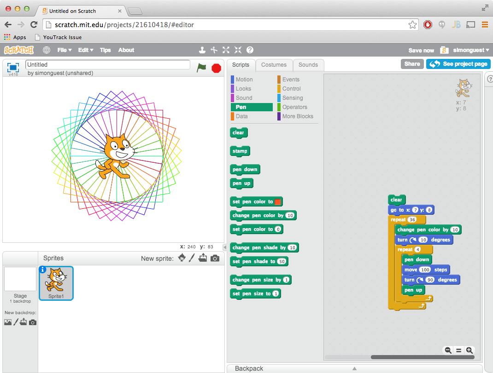

# Learn To Code
## Lesson 1 - Introduction

---

# What is a computer?

---

# How do you get computers to _do things_?

---

# What is a _Computer Program_?

---

# What can computer programs do?

---

# What does a computer program look like?

---

# Sample Computer Program

```javascript
var add = function(x, y){
	return x + y;
};
```
---



---

# Scratch


---



---

# Today's Lesson

- Create an account
- Overview of blocks
- Simple motion
- Repeat loop
- Use the pen

